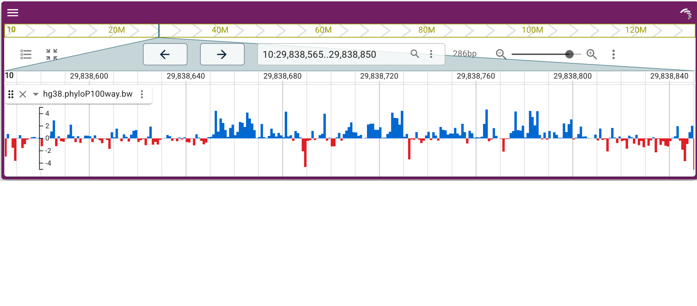
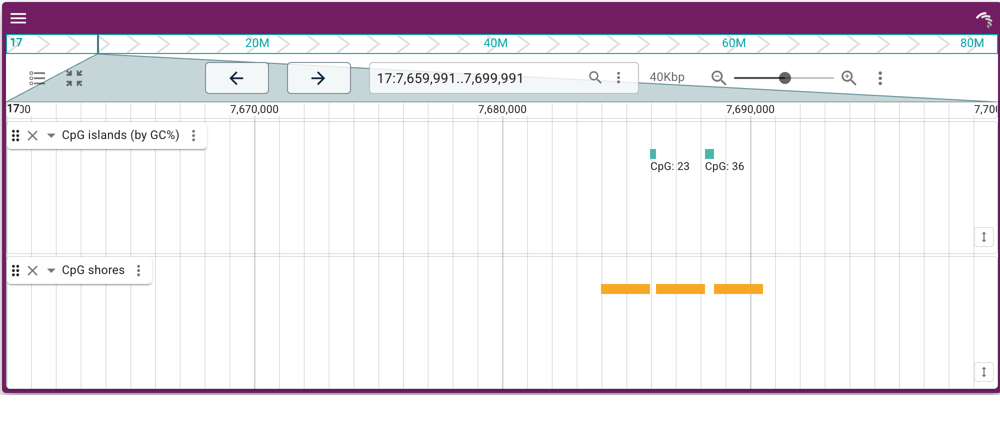
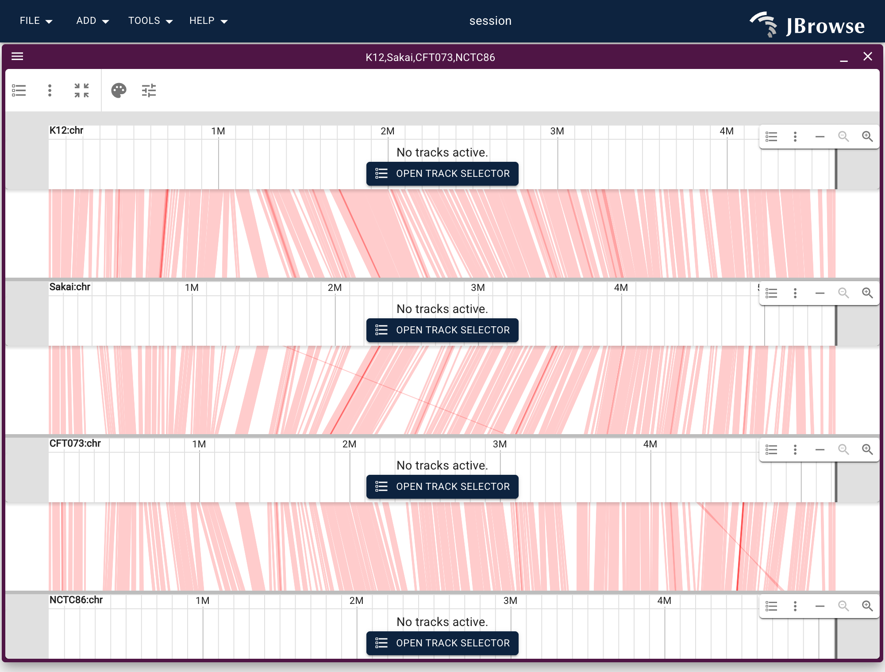
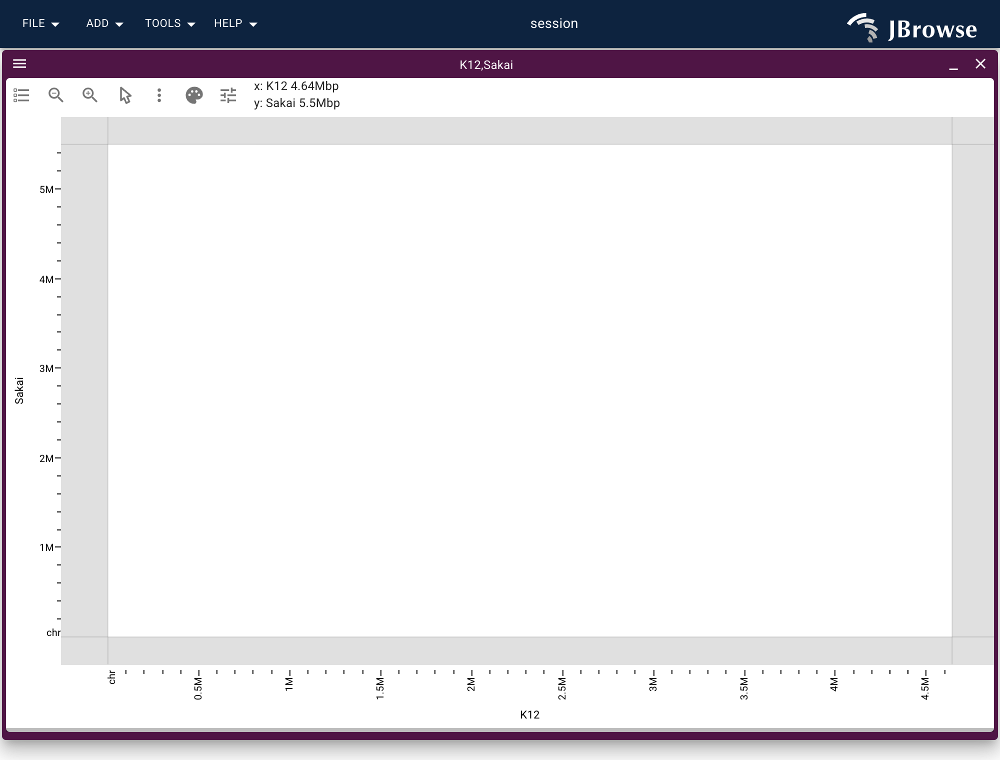

# jbrowse-anywidget

JBrowse 2 linear genome view as an [anywidget](https://anywidget.dev), drawn on
the GPU (WebGPU, with WebGL and Canvas2D fallbacks). One bundle renders in
Jupyter, JupyterLab, VS Code, Colab, and marimo, with two-way sync of the
visible region between Python and the view.

This is the modern replacement for the Dash-based `jbrowse-jupyter` +
`dash_jbrowse` stack: no Dash server, no `dash-generate-components`, no webpack —
just a Vite-bundled ESM file loaded by anywidget.

## What it looks like

Every figure below is rendered headless from the built bundle by
`scripts/screenshot_examples.mjs`, out of the declarative config in
`scripts/gen_screenshot_specs.py` — so they show what the notebooks actually
produce, not a mock-up.

A linear view with a conservation bigWig ([quickstart notebook](https://colab.research.google.com/github/GMOD/jbrowse-anywidget/blob/main/examples/01_quickstart.ipynb)):



A bioframe interval result dropped onto the genome — CpG islands colored by GC%,
plus their shores ([notebook](https://colab.research.google.com/github/GMOD/jbrowse-anywidget/blob/main/examples/02_dataframe_analysis.ipynb)):



GPU-rendered CRAM alignments over BRCA1, from a hub assembly named by string
([notebook](https://colab.research.google.com/github/GMOD/jbrowse-anywidget/blob/main/examples/03_alignments.ipynb)):


Multi-sample structural variants, one row per sample, colored by cohort
([notebook](https://colab.research.google.com/github/GMOD/jbrowse-anywidget/blob/main/examples/04_multisample_variants.ipynb)):


Four E. coli strains compared with an all-vs-all PAF, and the same alignment as
a dotplot — both from `JBrowseApp`
([notebook](https://colab.research.google.com/github/GMOD/jbrowse-anywidget/blob/main/examples/11_synteny_ecoli.ipynb)):





## Try it in Colab

- Quickstart — [](https://colab.research.google.com/github/GMOD/jbrowse-anywidget/blob/main/examples/01_quickstart.ipynb)
- bioframe result → track (real CpG islands + shores) — [](https://colab.research.google.com/github/GMOD/jbrowse-anywidget/blob/main/examples/02_dataframe_analysis.ipynb)
- GPU alignments (BAM/CRAM) — [](https://colab.research.google.com/github/GMOD/jbrowse-anywidget/blob/main/examples/03_alignments.ipynb)
- Multi-sample variants — [](https://colab.research.google.com/github/GMOD/jbrowse-anywidget/blob/main/examples/04_multisample_variants.ipynb)
- Read depth from a BAM with pysam (NA12878 exome over BRCA1) — [](https://colab.research.google.com/github/GMOD/jbrowse-anywidget/blob/main/examples/05_bam_coverage.ipynb)
- Between-population selection scan (Fst) → view the sweep (Drosophila Cyp6g1, real DEST data) — [](https://colab.research.google.com/github/GMOD/jbrowse-anywidget/blob/main/examples/06_popgen_selection.ipynb)
- Differential expression → view — [](https://colab.research.google.com/github/GMOD/jbrowse-anywidget/blob/main/examples/07_differential_expression.ipynb)
- Easy human data (hosted assembly hub) — [](https://colab.research.google.com/github/GMOD/jbrowse-anywidget/blob/main/examples/08_hosted_assembly_hub.ipynb)
- Interactive controls — a slider that re-runs the analysis — [](https://colab.research.google.com/github/GMOD/jbrowse-anywidget/blob/main/examples/09_interactive_controls.ipynb)
- Region-reactive — recompute only what's on screen as you pan — [](https://colab.research.google.com/github/GMOD/jbrowse-anywidget/blob/main/examples/10_region_reactive.ipynb)
- Compare genomes — four E. coli strains in a linear synteny view — [](https://colab.research.google.com/github/GMOD/jbrowse-anywidget/blob/main/examples/11_synteny_ecoli.ipynb)

05–07 are the core loop — **run an analysis in Python, load the result onto the
genome** — using the tools scientists already reach for (pysam, bioframe,
scipy/statsmodels) on real data. 09–10 close the loop the other way: a widget
control or a pan in the view drives Python to **recompute and repaint**, live.

## Develop

The JS bundle links the GPU-rendered `@jbrowse/react-linear-genome-view2` (v4)
directly from a sibling `jbrowse-components` checkout so it tracks the latest
work — see the `link:` dependency in `package.json`. Clone that repo next to this
one:

```bash
git clone https://github.com/GMOD/jbrowse-components ../jbrowse-components
pnpm install        # resolves the link: dependency to ../jbrowse-components
pnpm build          # writes jbrowse_anywidget/static/index.js
pip install -e ".[dev]"
```

`pnpm dev` rebuilds the bundle on change. Then open a notebook from `examples/`.
Regenerate the notebooks with `python scripts/build_examples.py`.

## API sketch

A whole view is one declarative call. A `tracks=[...]` entry can be a bare
data-file URL — its track type and adapter are inferred from the extension — and
`assembly="hg38"` fetches a hosted genome by name, so nothing but URLs is needed:

```python
from jbrowse_anywidget import LinearGenomeView

view = LinearGenomeView(
    assembly="hg38",
    location="10:29,838,565..29,838,850",
    tracks=[
        "https://.../ncbiRefSeq.sort.gff.gz",
        "https://.../phyloP100way.bw",
        "https://.../reads.cram",
    ],
)
view            # display
view.location   # read back the user's current region
```

The track type and adapter are inferred from the file extension by the view
itself — using JBrowse's own format plugins, the same inference the "Add track"
flow uses — so there's no extension table in Python to fall behind: `.bam`,
`.cram`, `.bw`/`.bigwig`, `.bb`/`.bigbed`, `.vcf`(`.gz`), `.gff`(`.gz`)/`.gff3`(`.gz`),
`.gtf`(`.gz`), `.bed`(`.gz`), `.hic`, and anything else a bundled plugin knows.
The index defaults to the conventional sibling (`.bai`/`.crai`/`.tbi`); when your
index lives elsewhere — or is a `.csi` index — give a `(url, index)` pair instead
of a bare string. `assemblyNames` is filled from the view's assembly, so a
`tracks=[...]` list needs no per-track boilerplate.

`track(uri, name=..., ...)` is the same thing made explicit — reach for it to set
a display name or extra config. It returns a loose spec (`{"uri": ...}` plus
whatever you pass) that the view expands, so anything past the defaults (colors,
display settings, even a `type=` override) is just a keyword you add — the same
JBrowse config JSON, not a Python wrapper around it:

```python
from jbrowse_anywidget import track

view.add_track(track("https://.../reads.cram", name="Tumor"))
```

Under the shorthand it's all JBrowse's own config. Assemblies, tracks, and
sessions are the same [JSON-like dicts](https://jbrowse.org/jb2/docs/config_guide/)
JBrowse uses everywhere, handed straight to the view, so any track type or
adapter `track()` doesn't cover you write as a dict — the exact JSON from a
config file:

```python
view.add_track({
    "type": "AlignmentsTrack", "trackId": "reads", "name": "reads",
    "assemblyNames": ["hg38"],
    "adapter": {"type": "CramAdapter", "uri": ".../reads.cram"},
})

# the one thing JSON can't do: an in-memory DataFrame becomes a track, no file
view.add_features(df, name="my peaks", color="jexl:get(feature,'score')>0?'red':'blue'")
```

Python adds only what config JSON can't express itself: `track` (URI → loose
spec the view expands), `add_features` (DataFrame/list of dicts → track) and
`make_assembly` (a little assembly boilerplate). Everything else is `add_track(<config dict>)` — or
pass whole `tracks=[...]` / `default_session={...}` configs to the constructor.
Tracks are opened in the view automatically; removing one from `view.tracks`
closes it.

For a custom genome, `assembly=` also accepts a bare sequence-file URL
(`assembly=".../genome.fa.gz"`, or a `.2bit`) — the view builds the assembly from
it, deriving the name from the file — so `make_assembly` is only needed to add
reference-name aliases or a non-sibling index.

For human/model-organism data, `fetch_hub("hg38")` (also `hg19`, `mm10`, a
GenArk `GCA_...`) returns a ready, CORS-enabled assembly config from
genomes.jbrowse.org — sequence, refName aliases, cytobands, a gene-name search
index, and a catalog of hosted tracks — as plain JSON you pass in. Because the
assembly carries refName aliases, your own tracks line up even when they name
chromosomes differently (`chr17` vs `17`). See `examples/08_hosted_assembly_hub.ipynb`.

## Plots (GWAS Manhattan, and more)

A track's *display* can plot its data — a
[`GWASTrack`](https://jbrowse.org/jb2/docs/config/gwasadapter/) with a
[`LinearManhattanDisplay`](https://jbrowse.org/jb2/docs/config/linearmanhattandisplay/)
renders genome-wide summary statistics as a Manhattan plot right in the linear
view. The plot is just a `displays` block on the track config, so it needs no
special widget. The adapter's `uri` shorthand finds the `.tbi` index for you, and
JBrowse fills in `displayId`:

```python
LinearGenomeView(
    assembly="hg19",
    location="2",
    tracks=[{
        "type": "GWASTrack",
        "trackId": "gwas_track",
        "name": "GWAS",
        "assemblyNames": ["hg19"],
        "adapter": {
            "type": "GWASAdapter",
            "scoreColumn": "neg_log_pvalue",
            "uri": ".../summary_stats.txt.gz",
        },
        "displays": [{"type": "LinearManhattanDisplay", "height": 250}],
    }],
)
```


JBrowse's [config guide](https://jbrowse.org/jb2/docs/config_guide/) and the
per-type [config docs](https://jbrowse.org/jb2/docs/config/) cover many such
display-driven plots (Manhattan/LD, Hi-C matrices, multi-wiggle, sashimi) — each
is a track config plus a `displays` choice.

## Comparing genomes (synteny, dotplots)

`LinearGenomeView` is one linear view. For comparative genomics, `JBrowseApp`
drives the full app from a declarative `views=[...]` list — each entry a
`{"type", "init"}` dict (the same shape as JBrowse Web's
[`?session=spec-…` URLs](https://jbrowse.org/jb2/docs/urlparams/); the `init`
fields come from the view's
[state-model docs](https://jbrowse.org/jb2/docs/models/linearsyntenyview/)),
built with `linear_view`, `synteny_view`, and `dotplot_view`:

```python
from jbrowse_anywidget import JBrowseApp, synteny_view, synteny_track, make_assembly

JBrowseApp(
    assemblies=[make_assembly("hg38", hg38_fa), make_assembly("mm39", mm39_fa)],
    tracks=[synteny_track("hg38_mm39.paf", "hg38", "mm39")],
    views=[synteny_view(["hg38", "mm39"], tracks=["hg38-mm39-paf"])],
)
```

It loads a separate, larger bundle (the full app), so the single-view
`LinearGenomeView` stays lean.

`plugins=[...]` loads JBrowse plugins at runtime by name from the [plugin
store](https://jbrowse.org/jb2/plugin_store/), which is how view types that
don't ship in the bundle become available. A plugin's view has its own init
fields, so open it with the generic `view()` rather than a Python wrapper that
would fall out of step with the plugin:

```python
from jbrowse_anywidget import JBrowseApp, view

JBrowseApp(
    assemblies=[hg38],
    plugins=["Protein3d"],
    views=[view("ProteinView", url=".../AF-P04637-F1-model_v6.cif", height=600)],
)
```

## Publishing (to make the Colab links live)

The built JS bundle in `jbrowse_anywidget/static/` is committed, so the package
installs with no JS toolchain:

```bash
pnpm build                       # refresh the bundle after any src/ change
python -m build                  # sdist + wheel (includes static/)
twine upload dist/*              # -> PyPI, so `pip install jbrowse-anywidget` works
```

Then push to `github.com/GMOD/jbrowse-anywidget` and the Colab badges resolve.
Colab renders the widget because each notebook enables the custom widget
manager (`output.enable_custom_widget_manager()`).

## Status

Prototype consolidating two earlier experiments
(`experiments/jbrowse_lgv_widget`, `dont_care/jb2anywidget`), now bundling the
GPU-rendered v4 view. The eleven notebooks in `examples/` run top-to-bottom in
Colab; their analyses use the tools scientists already work in (bioframe
intervals, pysam coverage, scipy/statsmodels DE, DEST Fst windows) on real data,
and their track configs render in a headless browser. Two of them close the loop
the other way — a slider and a pan in the view drive Python to recompute and
repaint.

Synteny and dotplot views ship today via `JBrowseApp` (see above), and
[JBrowseR](https://github.com/GMOD/JBrowseR) wraps the same bundle for R. Next: a
binary fast-path for large feature sets.
